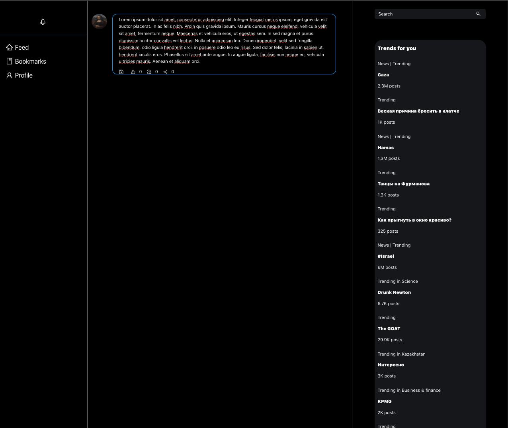
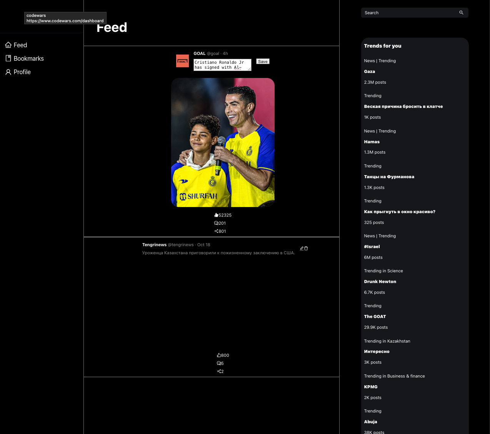
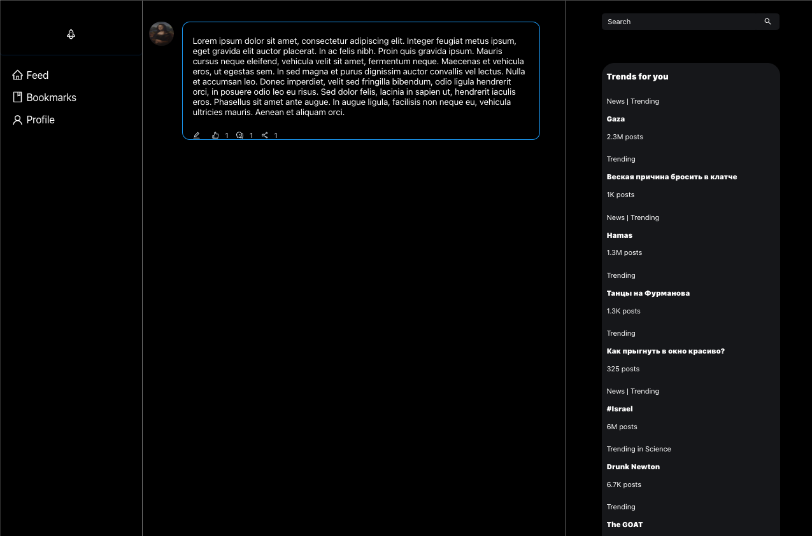

## Mussa Shaukenov 22MD0519

#### This project is dedicated for Midterm exam for Web development subject at KBTU, Almaty, Kazakhstan.
#### Any similar results except from my teammates can be considered as cheating since there is NO repositories in Github that uses new X design color pallet.

### Profile editing

### Post editing

### Post like, commennt, share system

### Post adding

